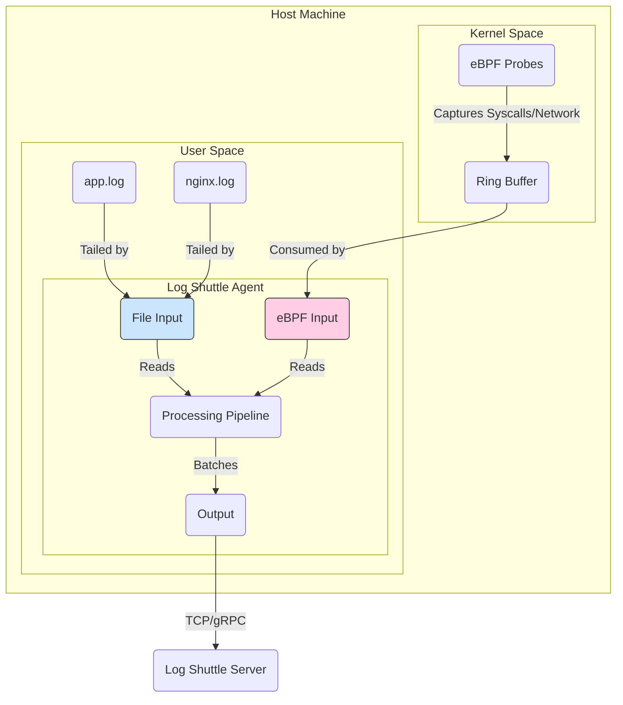

# Log Shuttle - A High-Performance Observability Agent

[English](./README.md) | [简体中文](./README.zh-CN.md)

### Powered by Rust & eBPF for Zero-Instrumentation Tracing

`log-shuttle` is a system-level agent designed for high-performance log aggregation and, ultimately, zero-instrumentation distributed tracing using eBPF.

The project's core philosophy is **"Log-First, Trace-Aware"**. Unlike traditional APM tools (like Jaeger/Dapper) that focus on sampled `traces`, Log Shuttle treats **100% of logs** as the primary source of truth and enriches them with system-wide context gathered by eBPF, providing a unified and complete observability experience.

This project is an ambitious exercise in Rust system programming, focusing on a clear multi-threaded architecture without relying on an async runtime.

## Core Architecture & Vision

The system is built on a robust pipeline architecture. The ultimate vision is to have multiple input sources, including traditional log files and advanced eBPF probes, feeding a unified processing pipeline.



## Project Structure

The project is organized as a Cargo Workspace with several dedicated crates. This design promotes modularity and clear separation of concerns.

```text
log-shuttle/
├── Cargo.toml          # Workspace configuration
├── README.md
├── README.zh-CN.md
└── crates/
    ├── agent/          # Main binary: orchestrates all other components
    ├── common/         # Shared data structures (Event, Error)
    ├── input/          # Input sources (e.g., FileInput, EBPFInput)
    ├── output/         # Output sinks (e.g., Stdout, TCP, gRPC)
    └── pipeline/       # Core logic for batching, routing, and backpressure
```

### Crate Responsibilities

| Crate      | Responsibility                                            |
| ---------- | --------------------------------------------------------- |
| `agent`    | The main executable. Parses CLI arguments, builds the pipeline by wiring up the other crates, and manages the application lifecycle (startup, shutdown). |
| `common`   | Contains shared data structures like `Event` and `Error` that are used across the entire workspace. Ensures consistency. |
| `input`    | Defines input source traits and implementations. Each input (e.g., tailing a file) runs in its own thread and sends data to the pipeline. |
| `pipeline` | The heart of the agent. Handles data as it flows from input to output. Responsible for batching, transformations, and backpressure. |
| `output`   | Defines output sink traits and implementations. Each output (e.g., writing to stdout or a TCP socket) receives batches from the pipeline. |

## The eBPF Advantage: Zero-Instrumentation Tracing

The key differentiator for this project is the planned integration of **eBPF (Extended Berkeley Packet Filter)**.

|                | Traditional APM (e.g., Jaeger)        | Log Shuttle (with eBPF)                     |
| -------------- | ------------------------------------- | ------------------------------------------- |
| **How it Works** | Requires code changes (SDKs, libraries) | **No code changes needed** (zero-instrumentation) |
| **Data Source**  | Sampled traces, limited logs          | **100% of logs** + kernel-level events      |
| **Visibility**   | Application-level calls             | App calls + Network + Syscalls + Kernel     |
| **Experience**   | Separate systems for traces and logs  | **Unified view** of traces and logs         |

### Pros and Cons of the eBPF Approach

**Advantages:**
*   ✅ **Zero-Instrumentation**: No need to modify or even restart applications to observe them.
*   ✅ **Holistic View**: Correlate application logs with low-level system events (network, file I/O) for ultimate context.
*   ✅ **Language Agnostic**: Works for any programming language (C++, Java, Python, Go, etc.) without specific SDKs.
*   ✅ **High Performance**: eBPF programs run in a sandboxed, JIT-compiled environment inside the kernel, making them extremely fast.

**Challenges (This is why it's a great learning project!):**
*   ⚠️ **Steep Learning Curve**: eBPF programming is complex and involves kernel-space logic.
*   ⚠️ **Linux-Specific**: eBPF is a Linux kernel feature. The agent's tracing capabilities will be limited to Linux hosts.
*   ⚠️ **Requires Privileges**: Loading eBPF programs requires `root` or `CAP_SYS_ADMIN` capabilities.
*   ⚠️ **Kernel Version Dependent**: Features and stability can vary between Linux kernel versions.

## Usage (Hypothetical)

The agent is designed to be simple to run.

```bash
# Tail a log file and stream to a remote server
./log-shuttle --input-file /var/log/app.log --output-tcp 10.0.1.100:5144

# (Future) Activate eBPF tracing for all HTTP traffic and stream results
# This would automatically discover processes and trace their requests.
sudo ./log-shuttle --ebpf-http-tracing --output-grpc 10.0.1.100:50051
```

## Phased TODO List: The Road to eBPF

We will build this project in deliberate phases. Each phase is a valuable project in its own right.

### Phase 1: The Foundation - A Rock-Solid Pipeline (Our Current Goal)

> 🎯 **Goal**: Build a stable, high-performance, single-threaded `input -> pipeline -> output` agent that tails a file and prints to stdout. This validates the core architecture.

*   [ ] **Project Setup**:
    *   [ ] Create Cargo Workspace (`agent`, `input`, `pipeline`, `output`, `common`).
    *   [ ] Move existing `main.rs` into `crates/agent/src/main.rs`.
    *   [ ] Configure workspace `Cargo.toml`.
*   [ ] **`common` crate**:
    *   [ ] Define the core `Event` data structure.
    *   [ ] Define a unified `Error` type for the project.
*   [ ] **`pipeline` crate**:
    *   [ ] Implement a bounded channel using `crossbeam::channel` for backpressure.
    *   [ ] Create a `Batch` component that collects events.
*   [ ] **`input` crate**:
    *   [ ] Implement a `FileInput` component that can `tail` a file.
    *   [ ] On each new line, create an `Event` and send it into the pipeline channel.
*   [ ] **`output` crate**:
    *   [ ] Implement an `StdOutOutput` component that receives event batches.
    *   [ ] Print the content of the events to the console.
*   [ ] **`agent` crate**:
    *   [ ] Parse CLI arguments (e.g., input file path).
    *   [ ] Wire everything together: `FileInput` -> `channel` -> `StdOutOutput`.
    *   [ ] Implement graceful shutdown on `Ctrl-C`.

### Phase 2: Production-Hardening

> 🎯 **Goal**: Make the agent robust and ready for real-world scenarios.

*   [ ] **Concurrency**: Convert the agent to a multi-threaded model (Input, Pipeline, Output each on their own thread).
*   [ ] **Durability**: Add file rotation handling in `FileInput`.
*   [ ] **Networking**: Implement a `TcpOutput` / `GrpcOutput` to send data to a remote server.
*   [ ] **Testing**: Build a benchmark suite to test throughput, latency, and backpressure.

### Phase 3: The Leap to eBPF

> 🎯 **Goal**: Integrate eBPF to achieve zero-instrumentation tracing for network events.

*   [ ] **eBPF Crate**: Set up a Rust eBPF library like `aya-rs`.
*   [ ] **Kernel Probe**: Write a simple eBPF program (probe) to attach to kernel functions for network sockets (`tcp_connect`, `tcp_close`).
*   [ ] **`EBPFInput`**: Create a new input component that loads the eBPF probe into the kernel and reads events from the ring buffer.
*   [ ] **Data Fusion**: In the pipeline, correlate eBPF events with process IDs.

---
