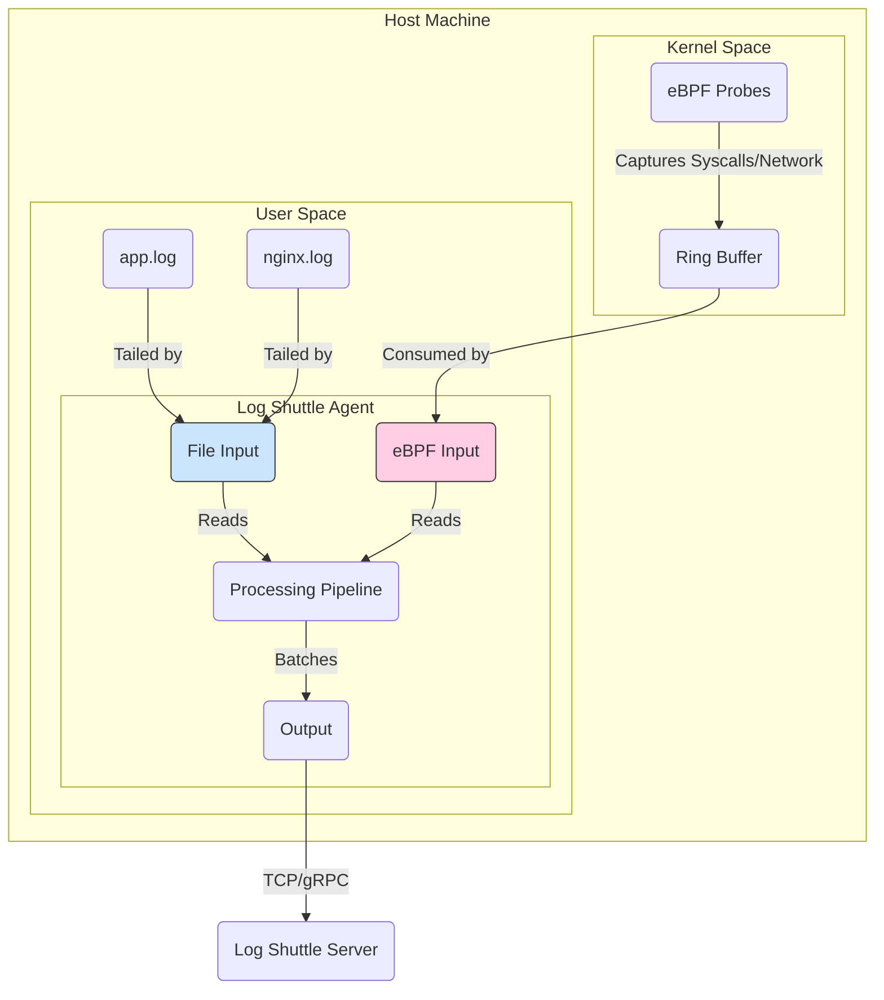

# Log Shuttle - 高性能可观测性代理

[English](./README.md) | [简体中文](./README.zh-CN.md)

### 由 Rust & eBPF 驱动的零侵入追踪

`log-shuttle` 是一个系统级代理，专为高性能日志聚合而设计，其最终目标是利用 eBPF 实现零侵入的分布式追踪。

项目的核心理念是 **"日志优先，追踪感知" (Log-First, Trace-Aware)**。与传统的 APM 工具（如 Jaeger/Dapper）专注于采样的 `追踪(traces)` 不同，Log Shuttle 将 **100% 的日志** 视为唯一的真相来源，并通过 eBPF 收集的系统级上下文来丰富它们，从而提供一个统一且完整的可观测性体验。

本项目是一次雄心勃勃的 Rust 系统编程实践，专注于一个清晰的多线程架构，而不依赖于 async 运行时。

## 核心架构与愿景

系统构建在一个健壮的流水线架构之上。最终愿景是拥有多个输入源，包括传统的日志文件和先进的 eBPF 探针，共同为一个统一的处理流水线提供数据。



## 项目结构

项目被组织成一个 Cargo Workspace，包含几个专用的 crates。这种设计促进了模块化和明确的关注点分离。

```text
log-shuttle/
├── Cargo.toml          # Workspace 配置
├── README.md
├── README.zh-CN.md
└── crates/
    ├── agent/          # 主程序：协调所有其他组件
    ├── common/         # 共享数据结构 (Event, Error)
    ├── input/          # 输入源 (例如, FileInput, EBPFInput)
    ├── output/         # 输出端 (例如, Stdout, TCP, gRPC)
    └── pipeline/       # 核心逻辑：批处理、路由和反压
```

### Crate 职责

| Crate      | 职责                                            |
| ---------- | --------------------------------------------------------- |
| `agent`    | 主执行程序。解析命令行参数，通过连接其他 crates 来构建流水线，并管理应用程序的生命周期（启动、关闭）。 |
| `common`   | 包含在整个工作空间中使用的共享数据结构，如 `Event` 和 `Error`。确保一致性。 |
| `input`    | 定义输入源的 traits 和实现。每个输入（例如，监控文件）都在其自己的线程中运行，并将数据发送到流水线。 |
| `pipeline` | 代理的核心。处理从输入到输出的数据流。负责批处理、转换和反压。 |
| `output`   | 定义输出槽的 traits 和实现。每个输出（例如，写入标准输出或 TCP 套接字）从流水线接收批处理数据。 |

## eBPF 的优势：零侵入追踪

本项目的关键区别在于计划集成 **eBPF (扩展伯克利包过滤器)**。

|                | 传统 APM (例如, Jaeger)      | Log Shuttle (使用 eBPF)                     |
| -------------- | ----------------------------- | ------------------------------------------- |
| **工作原理**     | 需要修改代码 (SDKs, 库)       | **无需修改代码** (零侵入)                   |
| **数据源**       | 采样的追踪，有限的日志      | **100% 的日志** + 内核级事件                 |
| **可见性**       | 应用级调用                  | 应用调用 + 网络 + 系统调用 + 内核           |
| **体验**         | 追踪和日志是分离的系统      | **统一的追踪与日志视图**                      |

### eBPF 方法的优缺点

**优势:**
*   ✅ **零侵入 (Zero-Instrumentation)**: 无需修改甚至重启应用即可对其进行观测。
*   ✅ **全局视野 (Holistic View)**: 将应用日志与底层系统事件（网络、文件I/O）关联，获得终极上下文。
*   ✅ **语言无关 (Language Agnostic)**: 无需特定SDK，适用于任何编程语言（C++, Java, Python, Go 等）。
*   ✅ **高性能 (High Performance)**: eBPF 程序在内核的一个沙箱化、JIT编译的环境中运行，速度极快。

**挑战 (这也是为什么它是一个很好的学习项目!):**
*   ⚠️ **学习曲线陡峭 (Steep Learning Curve)**: eBPF 编程很复杂，涉及内核空间逻辑。
*   ⚠️ **Linux 特定 (Linux-Specific)**: eBPF 是一个 Linux 内核特性，本代理的追踪能力将仅限于 Linux 主机。
*   ⚠️ **需要特权 (Requires Privileges)**: 加载 eBPF 程序需要 `root` 或 `CAP_SYS_ADMIN` 权限。
*   ⚠️ **依赖内核版本 (Kernel Version Dependent)**: 功能和稳定性可能因 Linux 内核版本而异。

## 使用示例 (构想)

代理的设计力求运行简单。

```bash
# 监控日志文件并将流发送到远程服务器
./log-shuttle --input-file /var/log/app.log --output-tcp 10.0.1.100:5144

# (未来功能) 激活对所有 HTTP 流量的 eBPF 追踪
# 这将自动发现进程并追踪它们的请求
sudo ./log-shuttle --ebpf-http-tracing --output-grpc 10.0.1.100:50051
```

## 分阶段 TODO 清单：通往 eBPF 之路

我们将分阶段构建这个项目。每个阶段本身都是一个有价值的项目。

### 阶段一：奠定基石 - 坚如磐石的流水线 (当前目标)

> 🎯 **目标**: 构建一个稳定、高性能、单线程的 `输入 -> 流水线 -> 输出` 代理，它可以监控文件并打印到标准输出。以此来验证核心架构。

*   [ ] **项目设置 (Project Setup)**:
    *   [ ] 创建 Cargo Workspace (`agent`, `input`, `pipeline`, `output`, `common`)。
    *   [ ] 将现有的 `main.rs` 移动到 `crates/agent/src/main.rs`。
    *   [ ] 配置工作区 `Cargo.toml`。
*   [ ] **`common` crate**:
    *   [ ] 定义核心 `Event` 数据结构。
    *   [ ] 定义项目统一的 `Error` 类型。
*   [ ] **`pipeline` crate**:
    *   [ ] 使用 `crossbeam::channel` 实现有界通道以支持反压。
    *   [ ] 创建收集事件的 `Batch` 组件。
*   [ ] **`input` crate**:
    *   [ ] 实现可 `tail` 文件的 `FileInput` 组件。
    *   [ ] 对每一个新行，创建 `Event` 并发送到流水线通道。
*   [ ] **`output` crate**:
    *   [ ] 实现接收事件批次的 `StdOutOutput` 组件。
    *   [ ] 将事件内容打印到控制台。
*   [ ] **`agent` crate**:
    *   [ ] 解析命令行参数 (例如，输入文件路径)。
    *   [ ] 将各组件连接起来: `FileInput` -> `channel` -> `StdOutOutput`。
    *   [ ] 实现 `Ctrl-C` 优雅停机。

### 阶段二：生产级加固

> 🎯 **目标**: 使代理更健壮，为真实世界场景做好准备。

*   [ ] **并发 (Concurrency)**: 将代理转换为多线程模型。
*   [ ] **持久性 (Durability)**: 在 `FileInput` 中增加日志滚动处理。
*   [ ] **网络 (Networking)**: 实现 `TcpOutput` / `GrpcOutput`。
*   [ ] **测试 (Testing)**: 构建基准测试套件。

### 阶段三：飞跃到 eBPF

> 🎯 **目标**: 集成 eBPF 以实现零侵入追踪。

*   [ ] **eBPF Crate**: 配置 Rust eBPF 库，如 `aya-rs`。
*   [ ] **内核探针 (Kernel Probe)**: 编写简单的 eBPF 程序以挂载到内核函数。
*   [ ] **`EBPFInput`**: 创建新的输入组件，从 eBPF 环形缓冲区读取事件。
*   [ ] **数据融合 (Data Fusion)**: 将 eBPF 事件与进程 ID 相关联。
---
